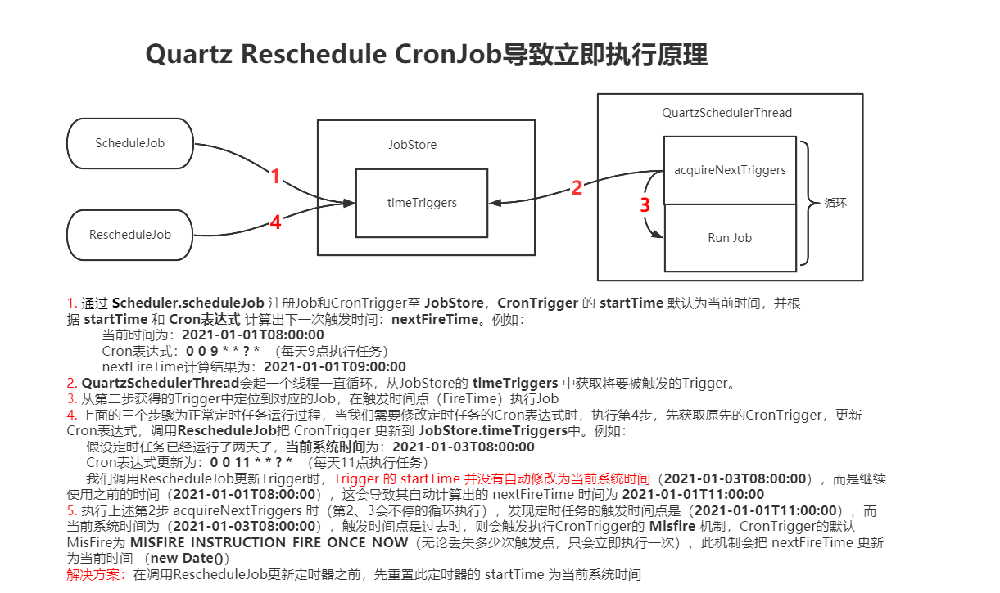

# Scheduler

## XXL-JOB

XXL-JOB是一个轻量级分布式任务调度平台，其核心设计目标是开发迅速、学习简单、轻量级、易扩展。现已开放源代码并接入多家公司线上产品线，开箱即用。

### 注意事项

#### 1.下载源码、初始化“调度数据库”

请下载项目源码并解压，获取 "调度数据库初始化SQL脚本" 并执行即可。

"调度数据库初始化SQL脚本" 位置为: `/xxl-job/doc/db/tables_xxl_job.sql`

调度中心支持集群部署，集群情况下各节点务必连接同一个mysql实例;如果mysql做主从,调度中心集群节点务必强制走主库;

源码地址：https://github.com/xuxueli/xxl-job/archive/2.1.0.zip

#### 2.环境要求
* Maven3+
* Jdk1.7+
* Mysql5.7+

#### 3.编译打包、运行`xxl-job-admin`

解压xxl-job源码后，修改xxl-job-admin中application.properties的数据库相关配置项。然后直接通过Maven编译打包，运行xxl-job-admin。

如果此调度中心已集群方式运行，则确保每个实例都连的相同数据库，且集群机器时钟保持一致。

#### 4.配置部署“执行器项目”

```xml
<dependency>
    <groupId>com.xuxueli</groupId>
    <artifactId>xxl-job-core</artifactId>
    <version>${最新稳定版本}</version>
</dependency>
```

`xxl-job-executor-samples`项目下包含了几个Demo。执行器项目配置说明：

```
### 调度中心部署跟地址 [选填]：如调度中心集群部署存在多个地址则用逗号分隔。执行器将会使用该地址进行"执行器心跳注册"和"任务结果回调"；为空则关闭自动注册；
xxl.job.admin.addresses=http://127.0.0.1:8080/xxl-job-admin

### 执行器AppName [选填]：执行器心跳注册分组依据；为空则关闭自动注册
xxl.job.executor.appname=xxl-job-executor-sample

### 执行器IP [选填]：默认为空表示自动获取IP，多网卡时可手动设置指定IP，该IP不会绑定Host仅作为通讯实用；地址信息用于 "执行器注册" 和 "调度中心请求并触发任务"；
xxl.job.executor.ip=

### 执行器端口号 [选填]：小于等于0则自动获取；默认端口为9999，单机部署多个执行器时，注意要配置不同执行器端口；
xxl.job.executor.port=9999

### 执行器通讯TOKEN [选填]：非空时启用；
xxl.job.accessToken=

### 执行器运行日志文件存储磁盘路径 [选填] ：需要对该路径拥有读写权限；为空则使用默认路径；
xxl.job.executor.logpath=/data/applogs/xxl-job/jobhandler

### 执行器日志保存天数 [选填] ：值大于3时生效，启用执行器Log文件定期清理功能，否则不生效；
xxl.job.executor.logretentiondays=-1
```

注意事项：
* 执行器回调地址（xxl.job.admin.addresses）需要保持一致；执行器根据该配置进行执行器自动注册等操作。
* 同一个执行器集群内AppName（xxl.job.executor.appname）需要保持一致；调度中心根据该配置动态发现不同集群的在线执行器列表。

#### 5.访问令牌（AccessToken）

为提升系统安全性，调度中心和执行器进行安全性校验，双方AccessToken匹配才允许通讯；

调度中心和执行器，可通过配置项 "xxl.job.accessToken" 进行AccessToken的设置。

调度中心和执行器，如果需要正常通讯，只有两种设置；

* 调度中心和执行器，均不设置AccessToken；关闭安全性校验；
* 调度中心和执行器，设置了相同的AccessToken；


### 文档

* [官方文档](https://www.xuxueli.com/xxl-job/#/)
    
    * `启动/停止任务` - 可对任务进行“启动”和“停止”操作。 需要注意的是，此处的启动/停止仅针对任务的后续调度触发行为，不会影响到已经触发的调度任务，如需终止已经触发的调度任务，可查看“4.9 终止运行中的任务”
    * `调度中心API服务` - `com.xxl.job.core.biz.AdminBiz.java`/`com.xxl.job.admin.controller.JobInfoController.java`
    * `执行器API服务` - `com.xxl.job.core.biz.ExecutorBiz`
    * `故障转移 & 失败重试`
    * `任务失败告警` - 默认提供邮件失败告警，可扩展短信、钉钉等方式，扩展代码位置为 "JobFailMonitorHelper.failAlarm"；


## Elastic-Job

### Elastic-Job-Lite

Elastic-Job-Lite定位为轻量级无中心化解决方案，使用jar包的形式提供最轻量级的分布式任务的协调服务，外部依赖仅Zookeeper。注册中心仅用于作业注册和监控信息存储。而主作业节点仅用于处理分片和清理等功能。

环境要求：
* JDK1.7及其以上版本
* Zookeeper 3.4.6及其以上版本
* Maven 3.0.4及其以上版本

#### 最大限度利用资源

Elastic-Job-Lite也提供最灵活的方式，最大限度的提高执行作业的吞吐量。将分片项设置为大于服务器的数量，最好是大于服务器倍数的数量，作业将会合理的利用分布式资源，动态的分配分片项。

例如：3台服务器，分成10片，则分片项分配结果为服务器A=0,1,2;服务器B=3,4,5;服务器C=6,7,8,9。 如果服务器C崩溃，则分片项分配结果为服务器A=0,1,2,3,4;服务器B=5,6,7,8,9。在不丢失分片项的情况下，最大限度的利用现有资源提高吞吐量。

#### 运维平台

解压缩`elastic-job-lite-console-${version}.tar.gz`并执行`bin\start.sh`。打开浏览器访问`http://localhost:8899/`即可访问控制台。`8899`为默认端口号，可通过启动脚本输入`-p`自定义端口号。

`elastic-job-lite-console-${version}.tar.gz`可通过`mvn install`编译获取。

提供两种账户，管理员及访客，管理员拥有全部操作权限，访客仅拥有察看权限。默认管理员用户名和密码是`root/root`，访客用户名和密码是`guest/guest`，可通过`conf\auth.properties`修改管理员及访客用户名及密码。

运维平台和elastic-job-lite并无直接关系，是通过读取作业注册中心数据展现作业状态，或更新注册中心数据修改全局配置。

控制台只能控制作业本身是否运行，但不能控制作业进程的启动，因为控制台和作业本身服务器是完全分离的，控制台并不能控制作业服务器。


#### Note

* 为什么在代码或Spring配置文件中修改了作业配置，注册中心配置却没有更新?

    Elastic-Job-Lite采用无中心化设计，若每个客户端的配置不一致，不做控制的话，最后一个启动的客户端配置将会成为注册中心的最终配置。
    
    Elastic-Job-Lite提出了overwrite概念，可通过JobConfiguration或Spring命名空间配置。overwrite=true即允许客户端配置覆盖注册中心，反之则不允许。如果注册中心无相关作业的配置，则无论overwrite是否配置，客户端配置都将写入注册中心。

* Elastic-Job有何使用限制?

    作业启动成功后修改作业名称视为新作业，原作业废弃。
    
    同一台作业服务器可以运行多个相同的作业实例，但每个作业实例必须使用不同的JobInstanceId，因为作业运行时是按照IP和JobInstanceId注册和管理的。JobInstanceId可在作业配置中设置。
    
    一旦有服务器波动，或者修改分片项，将会触发重新分片；触发重新分片将会导致运行中的流式处理的作业在执行完本次作业后不再继续执行，等待分片结束后再恢复正常。
    
    开启monitorExecution才能实现分布式作业幂等性（即不会在多个作业服务器运行同一个分片）的功能，但monitorExecution对短时间内执行的作业（如每5秒一触发）性能影响较大，建议关闭并自行实现幂等性。

* 是否支持动态添加作业?

    动态添加作业这个概念每个人理解不尽相同。
    
    elastic-job-lite为jar包，由开发或运维人员负责启动。启动时自动向注册中心注册作业信息并进行分布式协调，因此并不需要手工在注册中心填写作业信息。 但注册中心与作业部署机无从属关系，注册中心并不能控制将单点的作业分发至其他作业机，也无法将远程服务器未启动的作业启动。elastic-job-lite并不会包含ssh免密管理等功能。
    
    elastic-job-cloud为mesos框架，由mesos负责作业启动和分发。 但需要将作业打包上传，并调用elastic-job-cloud提供的REST API写入注册中心。 打包上传属于部署系统的范畴elastic-job-cloud并未涉及。
    
    综上所述，elastic-job已做了基本动态添加功能，但无法做到真正意义的完全自动化添加。

* 作业与注册中心无法通信会如何?
    
    为了保证作业的在分布式场景下的一致性，一旦作业与注册中心无法通信，运行中的作业会立刻停止执行，但作业的进程不会退出，这样做的目的是为了防止作业重分片时，将与注册中心失去联系的节点执行的分片分配给另外节点，导致同一分片在两个节点中同时执行。 当作业节点恢复与注册中心联系时，将重新参与分片并恢复执行新的分配到的分片。

* 为什么界面Console中的作业状态是分片待调整?
    
    分片待调整表示作业已启动但尚未获得分片时的状态。


#### 文档

* [官方文档](http://elasticjob.io/docs/elastic-job-lite/00-overview/intro/)
    * [架构图](http://elasticjob.io/docs/elastic-job-lite/00-overview/intro/)
    * [目录结构说明](http://elasticjob.io/docs/elastic-job-lite/03-design/module/)
    * [实现原理](http://elasticjob.io/docs/elastic-job-lite/03-design/lite-design/)
        * 弹性分布式实现
        * 注册中心数据结构
        * 流程图
    * [运维平台](http://elasticjob.io/docs/elastic-job-lite/02-guide/web-console/)
    * [配置手册](http://elasticjob.io/docs/elastic-job-lite/02-guide/config-manual/)
    * [作业分片策略](http://elasticjob.io/docs/elastic-job-lite/02-guide/job-sharding-strategy/)
    * [事件追踪](http://elasticjob.io/docs/elastic-job-lite/02-guide/event-trace/)
    * [作业运行状态监控](http://elasticjob.io/docs/elastic-job-lite/02-guide/execution-monitor/)
    * [DUMP作业运行信息](http://elasticjob.io/docs/elastic-job-lite/02-guide/dump/)
    * [作业监听器](http://elasticjob.io/docs/elastic-job-lite/02-guide/job-listener/)
    * [自诊断修复](http://elasticjob.io/docs/elastic-job-lite/02-guide/job-reconcile/)
    * [定制化处理](http://elasticjob.io/docs/elastic-job-lite/02-guide/customized-hook/)


### Elastic-Job-Cloud

Elastic-Job-Cloud使用`Mesos + Docker`的解决方案，额外提供资源治理、应用分发以及进程隔离等服务。


## 分布式调度参考链接

* [分布式调度框架大集合](https://blog.csdn.net/u012379844/article/details/82716146)
    * Cronsun
    * xxl-job
    * Elastic-job
    * Saturn
    * LTS
    * TBSchedule
* [分布式定时任务调度系统技术选型](https://www.cnblogs.com/davidwang456/p/9057839.html)


## Quartz

### 文档

* [Quartz Configuration Reference](https://www.quartz-scheduler.org/documentation/2.3.1-SNAPSHOT/configuration.html) - 包含所有的配置项及默认值
    * Configuration of Database Clustering (achieve fail-over and load-balancing with JDBC-JobStore)
* `StdSchedulerFactory`类中包含了配置项常量
* Tutorials
    * [The Quartz API, and Introduction to Jobs And Triggers](https://www.quartz-scheduler.org/documentation/2.3.1-SNAPSHOT/tutorials/tutorial-lesson-02.html)
    * [`More About Jobs` & `JobDetails` & `JobDataMap` & `Job State` & `Job Concurrency` & `Durability` & `RequestsRecovery`](https://www.quartz-scheduler.org/documentation/2.3.1-SNAPSHOT/tutorials/tutorial-lesson-03.html)
        * If you add setter methods to your job class that correspond to the names of keys in the JobDataMap (such as a setJobSays(String val) 
        method for the data in the example above), then Quartz’s default JobFactory implementation will automatically call those 
        setters when the job is instantiated, thus preventing the need to explicitly get the values out of the map within your execute method.
        * Triggers can also have JobDataMaps associated with them. This can be useful in the case where you have a Job that is stored 
        in the scheduler for regular/repeated use by multiple Triggers, yet with each independent triggering, you want to supply the 
        Job with different data inputs.
    * [More About Triggers](https://www.quartz-scheduler.org/documentation/2.3.1-SNAPSHOT/tutorials/tutorial-lesson-04.html)
    * [SimpleTriggers](https://www.quartz-scheduler.org/documentation/2.3.1-SNAPSHOT/tutorials/tutorial-lesson-05.html)
    * [CronTriggers - 含Cron表达式讲解](https://www.quartz-scheduler.org/documentation/2.3.1-SNAPSHOT/tutorials/tutorial-lesson-06.html)
    * [CronTrigger Tutorial - Cron表达式详解](https://www.quartz-scheduler.org/documentation/2.3.1-SNAPSHOT/tutorials/crontrigger.html)
    * [TriggerListeners & JobListeners](https://www.quartz-scheduler.org/documentation/2.3.1-SNAPSHOT/tutorials/tutorial-lesson-07.html)
    * [SchedulerListeners](https://www.quartz-scheduler.org/documentation/2.3.1-SNAPSHOT/tutorials/tutorial-lesson-08.html)
    * [JobStores](https://www.quartz-scheduler.org/documentation/2.3.1-SNAPSHOT/tutorials/tutorial-lesson-09.html)
        * RAMJobStore
        * JDBCJobStore
            
            > If your Scheduler is busy (i.e. nearly always executing the same number of jobs as the size of the thread pool, 
            then you should probably set the number of connections in the DataSource to be the about the size of the thread pool + 2.
            
            > The "org.quartz.jobStore.useProperties" config parameter can be set to "true" (defaults to false) in order to instruct JDBCJobStore 
            that all values in JobDataMaps will be Strings, and therefore can be stored as name-value pairs, rather than storing more 
            complex objects in their serialized form in the BLOB column. This is much safer in the long term, as you avoid the class 
            versioning issues that there are with serializing your non-String classes into a BLOB.
    * [Configuration, Resource Usage and SchedulerFactory](https://www.quartz-scheduler.org/documentation/2.3.1-SNAPSHOT/tutorials/tutorial-lesson-10.html)
    * [Advanced (Enterprise) Features](https://www.quartz-scheduler.org/documentation/2.3.1-SNAPSHOT/tutorials/tutorial-lesson-11.html)
        * Clustering
        * JTA Transactions
    
    * [Cookbook - 包含大多数日常操作 - 【重要】](https://www.quartz-scheduler.org/documentation/2.3.1-SNAPSHOT/cookbook/index.html)
        * [Initializing a Scheduler With Job And Triggers Defined in an XML file - 实现方案有点参考价值](https://www.quartz-scheduler.org/documentation/2.3.1-SNAPSHOT/cookbook/JobInitPlugin.html)
    * [Example - Dealing with Job Exceptions](https://www.quartz-scheduler.org/documentation/2.3.1-SNAPSHOT/examples/Example6.html)
    * [Example - Trigger Priorities](https://www.quartz-scheduler.org/documentation/2.3.1-SNAPSHOT/examples/Example14.html) - `Priority`值越大，优先级越高

* [FAQ](https://www.quartz-scheduler.org/documentation/2.3.1-SNAPSHOT/faq.html)
    * `Why isn’t my trigger firing?`章节 - `夏令时`对定时器的影响 - 【重要】
        > `SimpleTrigger` ALWAYS fires exactly every N seconds, with no relation to the time of day.
    
        > `CronTrigger` ALWAYS fires at a given time of day and then computes its next time to fire. If that time does not occur on a given day, the trigger will be **skipped**. 
        If the time **occurs twice** in a given day, it only fires once, because after firing on that time the first time, it computes the next time of day to fire on.
    * `How do I improve the performance of JDBC-JobStore?`
    * `I’m using JobStoreCMT and I’m seeing deadlocks, what can I do?`
    * `I’m seeing triggers stuck in the ACQUIRED state, or other weird data problems.`

* [Best Practices and Tips](https://www.quartz-scheduler.org/documentation/2.3.1-SNAPSHOT/best-practices.html)
    * Production System Tips
        * Skip Update Check
    * JobDataMap Tips
        * Only Store Primitive Data Types (including Strings) In the JobDataMap
        * Use the Merged JobDataMap
    * Trigger Tips
        * Use DateBuilder, TriggerBuilder and TriggerUtils.
    * JDBC JobStore
        * Never Write Directly To Quartz’s Tables
        * Never Point A Non-Clustered Scheduler At the Same Database As Another Scheduler With The Same Scheduler Name
        * Ensure Adequate Datasource Connection Size
    * Daylight Savings Time
        * Avoid Scheduling Jobs Near the Transition Hours of Daylight Savings Time
    * Jobs
        * Waiting For Conditions
        * Waiting For Conditions
        * Recoverability and Idempotence
    * Listeners (TriggerListener, JobListener, SchedulerListener)
        * Keep Code In Listeners Concise And Efficient
        * Keep Code In Listeners Concise And Efficient
    * Exposing Scheduler Functionality Through Applications
        * Be Careful of Security!

* `quartz-jobs`包中包含了常用的Job实现类
    * `SendMailJob`
    * `JMXInvokerJob`
    * jms
        * `SendQueueMessageJob`
        * `SendTopicMessageJob`
    * ejb
        * `EJB3InvokerJob`
        * `EJBInvokerJob`
    * `DirectoryScanJob`
    * `FileScanJob` - 检测文件是否改变
    * `NativeJob` - 执行系统命令
        
    ```xml
    <dependency>
      <groupId>org.quartz-scheduler</groupId>
      <artifactId>quartz-jobs</artifactId>
      <version>2.3.1</version>
    </dependency>
    ```

### Note

* By default, `StdSchedulerFactory` load a properties file named `quartz.properties` from the "current working directory". 
If that fails, then the `quartz.properties` file located (as a resource) in the `org/quartz` package is loaded. 
If you wish to use a file other than these defaults, you must define the system property `org.quartz.properties` to point to the file you want.

* Instances of the specified JobStore, ThreadPool, and other SPI classes will be created by name, 
and then any additional properties specified for them in the config file will be set on the instance by calling an equivalent `set` method. 
For example if the properties file contains the property `org.quartz.jobStore.myProp = 10` then after the JobStore class has been instantiated, 
the method `setMyProp()` will be called on it. Type conversion to primitive Java types (int, long, float, double, boolean, and String) 
are performed before calling the property’s setter method.

* One property can reference another property’s value by specifying a value following the convention of `$@other.property.name`, 
for example, to reference the scheduler’s instance name as the value for some other property, you would use `$@org.quartz.scheduler.instanceName`.

* Configuration of DataSources (for use by the JDBC-JobStores) - It is recommended that your Datasource max connection size be 
configured to be at least the number of worker threads in the thread pool plus three. You may need additional 
connections if your application is also making frequent calls to the scheduler API. If you are using JobStoreCMT, 
the "non managed" datasource should have a max connection size of at least four.

* Quartz Reschedule CronJob导致立即执行原理

    


