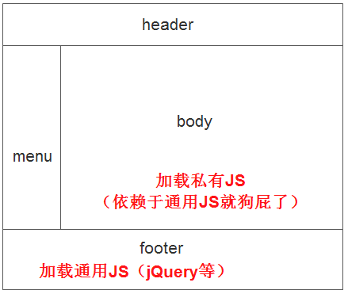

## 自由控制body页的代码片段

当碰到下图这种情况时，你需要考虑把私有JS挪动到公用JS后面。因为私有JS依赖于通用JS，而JS又是按照先后顺序执行的，所以运行私有JS会报错：



1. 第一个方案是把所有的私有JS都放到app.js里（名字随意取），然后把app.js放到通用JS后面。这是最垃圾的做法，建议不要使用。

2. 如果你用的是sitemesh2的话，有一种方案可以帮你，网上很难找到相关的资料，不看源码很才知道有这种解决方案的。

	**body页面**
	
	```html
	<html>
	<head>
	<title>XXX</title>
	</head>
	<body>
	......
	
		<!-- 内部JS -->
		<content tag="innerJs">
			<script type="text/javascript" src="xx.js"></script>
			<script type="text/javascript">
			$(function() {
				//.......
			});
			</script>
		</content>
		
	</body>
	</html>
	```
	
	**装饰页面**
	
	```html
	<html>
	<head>
	<title><decorator:title /></title>
	<decorator:head/>
	</head>
	<body>
	......
	
		<script type="text/javascript" src="jquery.js"></script>
		<decorator:getProperty property="page.innerJs" />
	</body>
	</html>
	```
	
	> content标签的tag名随意取，只要确保装饰页面的decorator:getProperty标签里面的值于其相同就行
	
3. 如果你使用的是sitemesh3的话，还有另一种解决方案，就是自定义标签，可以达到同样的效果。这种网上例子比较多，就不列举了。

