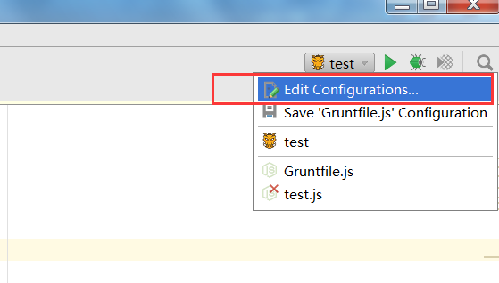
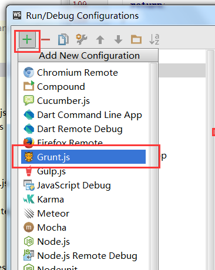
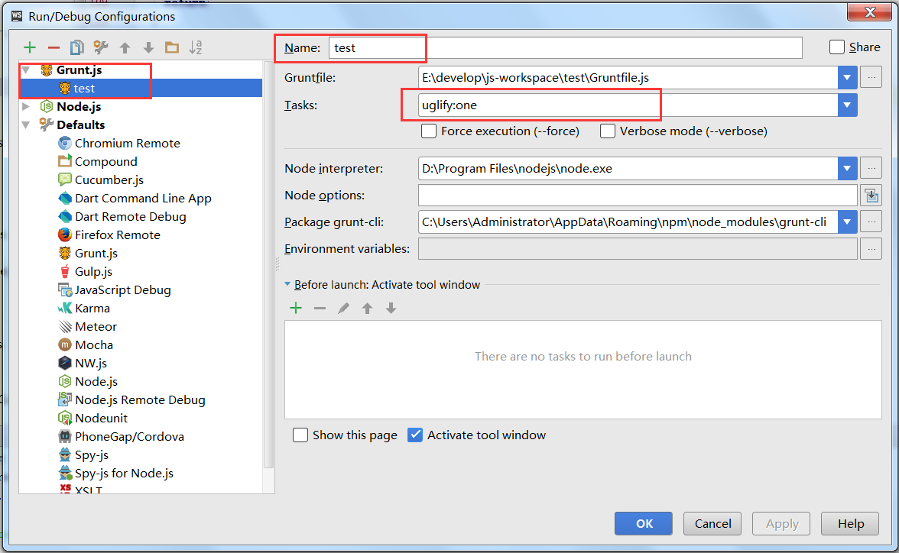
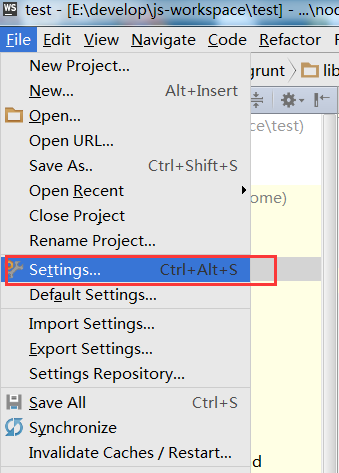
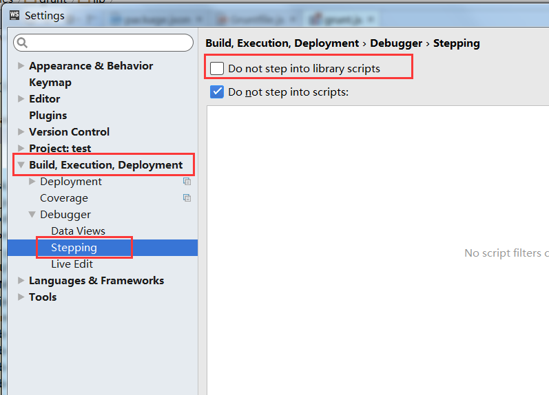

## WebStorm调试Grunt

#####　`【原创】` :heart_eyes:
---

最近刚玩NodeJS，选择了WebStorm作为开发工具。用的是最新版的WebStorm。本来想进入Debug模式看看源码的属性值及代码逻辑的，妹的，立马碰到了两个问题：  
1、怎么开启Grunt Debug模式  
2、进入Debug模式后，发现modules下的lib源码打了断点后，Debug模式的step over尽然没用 - -！ 也是醉了

###解决方案

1. **进入Grunt Debug模式：**

在WebStorm的右上角点击Edit Configurations

在弹出框中点击“+”按钮，选择Grunt.js

输入Name、Tasks等属性

上面的操作干完后，点击`小虫子`图标，恭喜你已经进入debug模式

2. **解决step over：**

当你进入Debug模式且在lib源码库打了个断点，你会遇到个很蛋疼的问题，`Step Over`、`Step Into`、`Step Out`都没用了，只有`Force Step Into`选项还有用。不知道WebStorm的团队是为了性能考虑还是为了用户体验考虑，才默认关闭这个功能。这咱先不管，也不想管。直接上解决方案
	
选择Settings选项卡

不用勾选`Do not step into library scripts`选项

